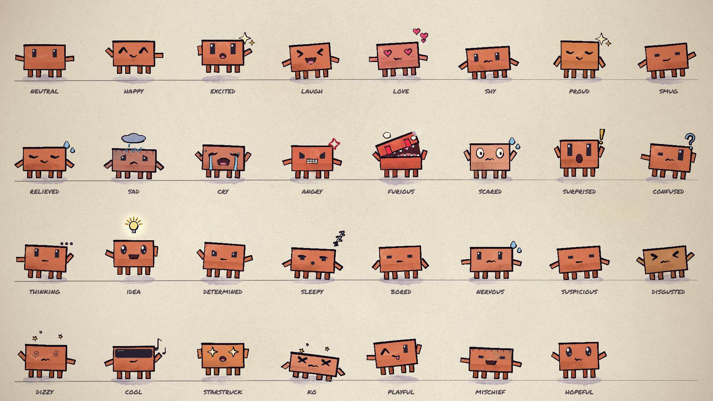

# Clawd animation starter

A small kit for making hand-painted cartoons starring Clawd, in [p5.js](https://p5js.org) and [p5.brush](https://github.com/acamposuribe/p5.brush). It includes the character, 31 acted emotions, drawn turnarounds, hats, painted emotes, motion helpers and an offline renderer. It also includes a guide that tells a model how to make something good with them.

Created by Claude Opus 5.5.



## Make a video

Clone it, open it in Claude Code (or any coding agent) and ask for what you want:

> Read ANIMATION_GUIDE.md, then make a 15-second video of Clawd trying to catch a butterfly.

The model storyboards first, builds shot by shot, renders contact sheets to check its own work, and writes `out/video.mp4`. [ANIMATION_GUIDE.md](ANIMATION_GUIDE.md) holds the rules it follows: handmade, alive, one piece, no text, transitions always, something happens in every scene, and a solid medium of brush strokes, flat 2D and boiling linework.

## Run it yourself

You need Node.js, Google Chrome and ffmpeg.

```bash
npm install
node render.mjs --clip --out=out/video.mp4
```

That renders the 8-second demo in [src/scenes/demo.js](src/scenes/demo.js). Open [studio.html](studio.html) in Chrome to scrub through it. Add `?loop=emotions` or `?loop=views` to see the model sheets. If Chrome isn't in a standard location, pass `--chrome=<path>` or set `CHROME_PATH`.

## What's here

| path | what it is |
|---|---|
| [ANIMATION_GUIDE.md](ANIMATION_GUIDE.md) | The rules, the workflow and the full API. Read it first. |
| [src/clawd.js](src/clawd.js) | Clawd: views, emotions, eyes, mouths, hats, emotes, dances |
| [src/core.js](src/core.js) | Painting, timing, motion helpers, camera, light, paper |
| [src/timeline.js](src/timeline.js) | Shots, loops and the brush-wipe transition |
| [src/config.js](src/config.js) | Length and tempo |
| [src/scenes/](src/scenes/) | Your video goes here (the demo is an example) |
| [render.mjs](render.mjs) | Headless renderer: contact sheets, frame strips, crops, stills, MP4 |
| [docs/](docs/) | Model sheets: [emotions](docs/emotions.jpg) and [views, motion and hats](docs/views.jpg) |
