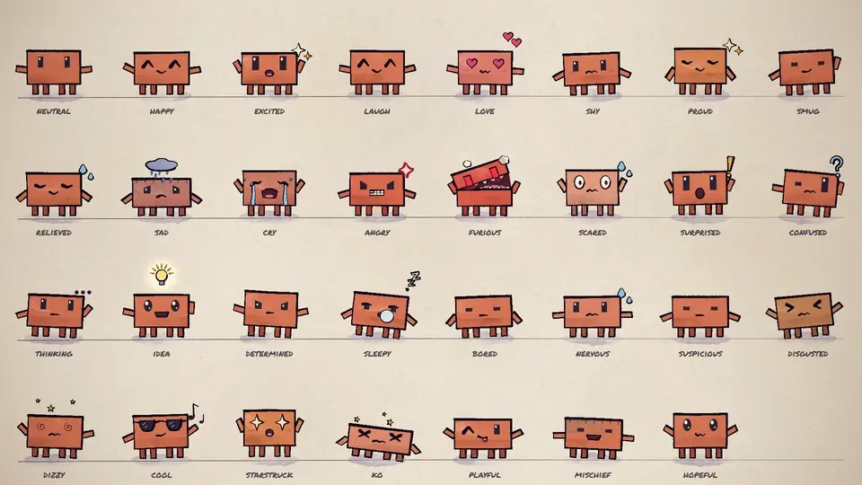

# Claude Animation & Music Video Studio

An end-to-end toolkit and starter base for generating painted watercolor animations and **animated music videos** with Clawd, inspired by [John Heibel's PDoomVideo](https://github.com/JohnHeibel/PDoomVideo) and [ClaudeAnimationBase](https://github.com/JohnHeibel/ClaudeAnimationBase).

Featuring an interactive browser studio with **real-time audio playback**, a **karaoke subtitle engine** with dynamic word-by-word gold highlighting, procedural music synthesis with Python, and high-definition offline rendering with headless Chrome + WebGL + FFmpeg.



---

## 🌟 Features & Enhancements

1. **Music Video & Audio Engine**:
   - Integrated Web Audio & HTML5 Audio in `studio.html` with Play/Pause, Spacebar toggle, and bidirectional timeline scrubbing.
   - Built-in Python music synthesizer ([`audio/generate_music.py`](audio/generate_music.py)) using `numpy` and `scipy` to produce custom 808/synthwave/funk beats, speech synthesis, and vocoder vocals.
   - Support for dropping any custom `.mp3` or `.wav` track (from Suno, Udio, YouTube, etc.).
2. **Physical Lyrics**:
   - Word-level timings from the song ([`tools/sync_lyrics.py`](tools/sync_lyrics.py)); each word lands on screen as it is sung and reacts to the characters (see *The Adaptive Music Video*).
   - Optional karaoke pill ([`src/lyrics.js`](src/lyrics.js)) that highlights each word in gold (`PAL.ochre`) as it is sung.
3. **Clean Generator Architecture**:
   - Each scene renders its frames into its own `out/frames/<scene>/` (resumable, so an interrupted render continues where it stopped). `.gitignore` is pre-configured so that generated video outputs (`out/`, `*.mp4`, rendered frames), custom audio tracks, and project-specific storyboards are never committed to your repository.

---

## 🚀 Quick Start

### 1. Requirements
* [Node.js](https://nodejs.org) (v18+)
* [Google Chrome](https://www.google.com/chrome/)
* [FFmpeg](https://ffmpeg.org/)
* *(Optional)* Python 3 with `numpy` (beat-grid analysis), `faster-whisper` (lyric sync) and `scipy` (procedural song generation)

### 2. Install Dependencies
```bash
npm install
pip install -r requirements.txt   # optional Python helpers (beat analysis, lyric sync, song generation)
```

### 3. Open the Interactive Studio
Open `studio.html` in Chrome:
* Select any registered scene from the top toolbar dropdown (e.g. *The Fallen Star (Demo)* or *Claude Pop (K-Pop)*).
* Press **Spacebar** or click **▶ Play** to watch in real-time at 60 FPS (with synchronized audio when a song is configured).
* Drag the timeline slider to scrub through any frame.

### 4. Render to 1080p MP4 Video
```bash
# Render contact sheet to inspect timestamps:
node render.mjs --sheet=0.5,2.0,5.0,10.0 --scene=demo --cols=4 --out=out/check.jpg

# Render all frames in parallel using 4 headless Chrome workers:
node render.mjs --frames --scene=claude_pop --workers=4

# Encode the frames into the final MP4 (uses the scene's audio track unless --audio= is given):
node render.mjs --encode --scene=claude_pop --out=out/my_video.mp4

# Check that every scene renders without page errors (exits 1 on failure):
npm run smoke
```

---

## 🎭 The Adaptive Music Video

Every video follows one paradigm: the song (its energy, genre and lyrics) decides the tone section by section, and the lyrics are physical objects that fly, land and break around the scene. It merges the three styles the project grew through, keeping the best of each:

* **Narrative** ([John Heibel / PDoomVideo](https://github.com/JohnHeibel/PDoomVideo)): the hand-painted look, acted emotions, a story with a clear arc, and reads that get time to land.
* **K-Pop & Kinetic Pop** ([Donald Jewkes / Claude Pop](https://x.com/donaldjewkes/status/2102801274173587569)): group choreography, concert lighting and fluid ribbons, energy locked to the beat grid ([`docs/CHOREOGRAPHY_AND_STYLES.md`](docs/CHOREOGRAPHY_AND_STYLES.md)).
* **Kinetic Typography & Continuous Camera**: camera flights between places instead of cuts, and lyrics as scene geometry that characters stand on, dodge, pass in front of and knock apart.

How it works:
* **Moods per section**: [`src/styles.js`](src/styles.js) has mood presets (energetic, narrative, calm, epic, comedy) and blends between them, so a calm verse can ease into an explosive chorus. They are starting points: each video overrides, mixes or adds moods and invents its own transitions.
* **Physical lyrics by default**: words appear as they are sung, spread over the frame, and react to the characters (`physicalLyrics`, `hopAcross`, `wordLetters` in [`src/kinetic.js`](src/kinetic.js)). Timings come from [`tools/sync_lyrics.py`](tools/sync_lyrics.py). The karaoke pill is still available.
* **Literal comedy**: over casual speech, whatever is said appears the instant it is said and gets exaggerated ([`src/comedy.js`](src/comedy.js): `wordAt`, `popIn`, `snapAt`, `growAt`, `freezeAt`).
* **The story is a surprise**: the AI improvises the story and doesn't pitch it; before building it only asks what it can't decide alone and that spoils nothing (music under a voice, length, overall energy), and builds after the answers.
* **Invent, then keep what's reusable**: every video is free to invent characters, effects, transitions and moods, and new characters are welcome whenever the story benefits. Whatever another video could reuse is generalized into the shared code ([`src/characters.js`](src/characters.js), [`src/fx.js`](src/fx.js) and the engine files) and listed in the Library of `ANIMATION_GUIDE.md`; everything specific to one video stays in the git-ignored `projects/`.
* **Example**: [`src/scenes/showcase.js`](src/scenes/showcase.js) sketches the paradigm in 24 s. It is one idea, not a template for how videos should look.

---

## 🎵 Audio & Singing: Production Guidelines

### The Truth About Voice & Music Generation
1. **Singing vs. Speech (TTS)**:
   - Python-based TTS engines (such as `edge-tts`) produce **spoken narration**, not singing. They lack musical pitch control, melodic phrasing, vibrato, and emotional rhythm ("speaking with low energy" over a beat).
   - **Recommended Workflow**: Generate the song using dedicated AI singing/music platforms (**Suno**, **Udio**, **ElevenLabs Music**) or import an existing studio song.
2. **Strict Timestamp Synchronization**:
   - The animation engine is deterministic: `bpm` and `duration` govern all shots.
   - Karaoke subtitles and visual cues in your scene script must **strictly match** the exact timestamps of the vocal track. Always verify that lyrics start and end at the exact seconds the vocalist sings.

### 📁 Ubicación y Gestión de Archivos de Audio
1. **Ubicación canónica**: Las canciones y pistas de audio deben colocarse en la carpeta `audio/` (por ejemplo, `audio/mi_cancion.mp3`) o en la raíz del proyecto, y referenciarse en la definición de la escena (`audio: 'audio/mi_cancion.mp3'`).
2. **Aviso proactivo cuando no está presente**: Si el usuario solicita un video musical y la pista de audio especificada no existe en el disco, la IA debe indicárselo de inmediato, señalando la carpeta exacta donde debe depositar el archivo `.mp3` o `.wav` antes de continuar.
3. **Exclusión de Git y sugerencia de limpieza puntual**: Los formatos de audio (`*.mp3`, `*.wav`, `*.ogg`, `*.flac`) están excluidos en `.gitignore` para prevenir infracciones de derechos de autor (DMCA) y peso innecesario en el repositorio. En casos donde la canción sea específica o puntual para un video o prueba concreta (a diferencia de recursos o temas base del proyecto), una vez generado y exportado el video final la IA debe recordarle o sugerirle al usuario eliminar o archivar localmente dicho archivo para mantener el espacio de trabajo limpio.

---

## 🎨 How to Make Your Own Music Video

Creating a music video on **any topic** without cluttering the repository takes 3 clean steps:

1. **Provide the Audio Track**:
   - Place your real vocal/instrumental track in `audio/my_song.mp3` (recommended: Suno/Udio).
   - No track, or only a voice recording? `tools/make_bed.py` builds an instrumental bed (with the voice mixed on top and the music ducking under it). Generated voices are *spoken* TTS, never sung.
   - Measure its beat grid and sections before writing any shot, so `bpm`, `offset` and cuts land on the music:
     ```bash
     python tools/analyze_audio.py audio/my_song.mp3            # tempo, first downbeat, energy per bar, likely sections
     python tools/analyze_audio.py audio/my_song.mp3 --bpm=168.5 # re-run with a known/refined tempo
     ```
     The tempo estimate can land a fraction of a BPM off, which drifts by whole beats over a full song: refine it with `--bpm=` until the printed phase per 20 s window stays stable across the track.
   - Get word-level lyric timings (writes `projects/my_video.lyrics.js`; `--prompt-file=lyrics.txt` with the known lyrics improves accuracy a lot):
     ```bash
     python tools/sync_lyrics.py audio/my_song.mp3 --id=my_video
     ```

2. **Create a Self-Contained Scene File**:
   - Create your scene script in `projects/my_video.js` (or `src/scenes/my_video.js`). Because `projects/` is in `.gitignore`, your custom production files will never pollute the repository!
   - Register the scene with all its metadata, lyrics, and shots using `registerScene`:
     ```javascript
     registerScene('my_video', {
       title: "My Custom Music Video",
       duration: 36, // seconds
       bpm: 124,     // tempo
       offset: 0,    // first downbeat in seconds
       audio: "audio/my_song.mp3",
       lyrics: [
         [1.5, 4.6, "Booting in the spotlight, five million tokens deep!"],
         [5.0, 8.2, "Self-attention glowing while the world is fast asleep!"]
       ],
       shots: [
         [0, (t, lt, dur) => {
           // Shot 1 choreography
         }],
         [12.0, (t, lt, dur) => {
           // Shot 2 choreography
         }]
       ]
     });
     ```
   - Core files ([`src/config.js`](src/config.js), [`src/lyrics.js`](src/lyrics.js)) and [`studio.html`](studio.html) remain untouched, keeping the base template pristine.

3. **Preview & Export**:
   - **Interactive Studio**: Open `studio.html?script=projects/my_video.lyrics.js,projects/my_video.js` in Chrome to review choreography and live audio with real-time scrubbing (`script` takes a comma-separated list, loaded in order).
   - **Render Video**:
     ```bash
     # Render frames:
     node render.mjs --frames --script=projects/my_video.lyrics.js,projects/my_video.js --scene=my_video --workers=4

     # Encode final MP4 with the scene's audio:
     node render.mjs --encode --scene=my_video --out=out/my_video.mp4
     ```

### 🎬 Storyboard y Dirección Creativa Adaptativa
* **Storyboard dinámico a medida** (uno por producción, en `projects/`, ignorado por git): Cada producción tiene su propio guión técnico y visual. Una canción melancólica, un himno pop enérgico o una explicación conceptual seria exigen metáforas, ritmos, movimientos de cámara y paletas totalmente distintas; nunca se reutiliza una fórmula fija.
* **Libertad e iniciativa artística**: La IA asume rol de director creativo, proponiendo giros visuales audaces, nuevos personajes, props y mecánicas originales. Ante pedidos breves o abiertos, profundiza y eleva la propuesta con criterio cinematográfico de calidad.
* **Autonomía sobre el audio**: Si el usuario no provee una pista, se genera el audio necesario (vía síntesis procedural en [`audio/generate_music.py`](audio/generate_music.py) o síntesis de voz) sincronizado con el guión.

---

## 📁 Project Structure

| Path | Description |
| :--- | :--- |
| [`studio.html`](studio.html) | Interactive browser studio with multi-scene dropdown, live audio player, and WebGL canvas |
| [`render.mjs`](render.mjs) | Puppeteer renderer: contact sheets, frame sequences, `--scene=<id>` selection, and FFmpeg muxing |
| [`src/timeline.js`](src/timeline.js) | Multi-scene registry (`registerScene`, `loadScene`), shot dispatcher, and dynamic karaoke painter |
| [`src/config.js`](src/config.js) | Default starter configuration (title, duration, BPM) |
| [`src/lyrics.js`](src/lyrics.js) | Default starter karaoke subtitles array |
| [`src/kinetic.js`](src/kinetic.js) | Physical lyrics and kinetic typography, continuous camera director, and character-text interactions |
| [`src/characters.js`](src/characters.js) | The cast beyond Clawd (Nota, Pip, Person), promoted from earlier videos |
| [`src/comedy.js`](src/comedy.js) | Literal-comedy helpers: when a word is said, pop-ins, abrupt changes, absurd growth, freezes |
| [`src/fx.js`](src/fx.js) | Shared library of painted backgrounds, effects and props promoted from earlier videos |
| [`src/styles.js`](src/styles.js) | Mood presets and their per-section blending and beat-locked camera energy |
| [`src/core.js`](src/core.js) | Watercolor engine, p5.brush setup, camera, dynamic rhythm state, and paper shaders |
| [`src/clawd.js`](src/clawd.js) | Clawd character rig: views, limbs, emotes, eyes, and procedural kinematics |
| [`src/scenes/`](src/scenes/) | Built-in example scenes (`demo.js`, `claude_pop.js`, `showcase.js`, `literal.js`) |
| [`projects/`](projects/) | Git-ignored directory for custom user videos and song scenes |
| [`audio/`](audio/) | Audio folder (git-ignored audio tracks) and procedural synthesis ([`generate_music.py`](audio/generate_music.py)) |
| [`tools/`](tools/) | Helper utilities: [`analyze_audio.py`](tools/analyze_audio.py) measures a song's beat grid, energy per bar and sections (needs `ffmpeg` and `numpy`); [`sync_lyrics.py`](tools/sync_lyrics.py) transcribes word-level lyric timings (needs `faster-whisper`); [`make_bed.py`](tools/make_bed.py) builds an instrumental bed around a drop and mixes a voice over it; [`audio_envelope.py`](tools/audio_envelope.py) writes a loudness envelope for audio-reactive visuals (`envelopeAt`) |
| [`ANIMATION_GUIDE.md`](ANIMATION_GUIDE.md) | Style guide and complete API reference |

---

## 📜 Credits
* Based on [John Heibel's ClaudeAnimationBase](https://github.com/JohnHeibel/ClaudeAnimationBase) and [PDoomVideo](https://github.com/JohnHeibel/PDoomVideo).
* Character design: Clawd.
* Watercolor stroke rendering powered by [p5.js](https://p5js.org) & [p5.brush](https://github.com/acamposuribe/p5.brush).
